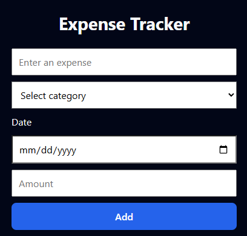

# Expense Tracker

A professional, client-side expense tracking web application built with **HTML, CSS, and Vanilla JavaScript**.

The app allows users to track expenses by category and date, analyze monthly spending, visualize trends with charts, and export data — all without a backend.

🔗 **Live Demo:**  
https://shadabshaikh07.github.io

---

## Preview



---

## Features

### Core Functionality
- Add expenses with:
  - Name
  - Category
  - Date
  - Amount (PLN)
- Automatic total calculation
- Category-wise totals
- Monthly expense summaries
- Persistent storage using browser `localStorage`

### Analytics & Visualization
- Monthly spending breakdown by category (bar chart)
- Daily spending trend for selected month (line chart)
- Charts update correctly on add, delete, and empty states
- Clean handling of months with no data

### UX & Polish (WOW Features)
- Dark / Light theme toggle (preference saved)
- Category filter for expense list
- Category-specific chart colors
- Smooth chart animations
- Formatted tooltips with PLN currency
- CSV export for spreadsheet tools
- Responsive, card-based UI with micro-interactions

---

## Why This Project

This project was built to simulate a real-world front-end application without relying on frameworks.

The focus was on:
- Manual state management in vanilla JavaScript
- Keeping multiple derived views in sync (list, totals, summaries, charts)
- Handling edge cases such as empty states and deletions
- Managing chart lifecycles correctly
- Writing clean, maintainable CSS during iterative UI changes
- Using Git properly, including rebasing and conflict resolution

The goal was not just to make it work, but to make it **robust and production-like**.

---

## Key Technical Decisions

- Centralized rendering logic to ensure consistent UI updates
- Used browser-native APIs (`localStorage`, `Intl.NumberFormat`)
- Explicitly destroyed and recreated Chart.js instances to avoid stale state
- Scoped CSS carefully to prevent unintended overrides
- Separated layout, data, and visualization concerns

---

## Tech Stack

- HTML5
- CSS3
- Vanilla JavaScript
- Chart.js
- Git & GitHub
- GitHub Pages (deployment)

---

## Running Locally

```bash
git clone https://github.com/shadabshaikh07/shadabshaikh07.github.io.git
cd shadabshaikh07.github.io
